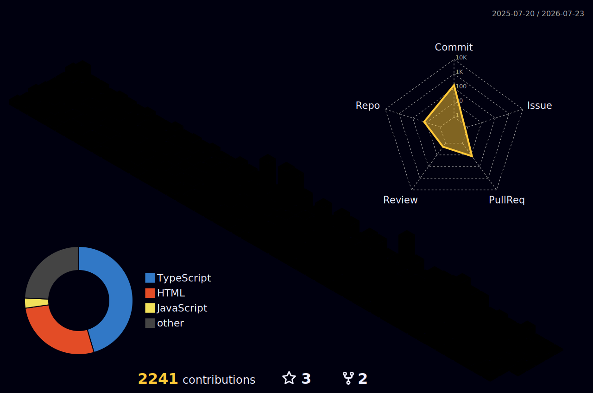

```💫 About Me```
<!-- # 🚀 Passionate Developer -->


<!-- Building scalable web applications, backend systems, dashboards, APIs, and modern digital products with real-world client experience. -->

I’m a **Developer** with hands-on **Full Stack** experience working on production-level applications involving:

- ⚡ Modern frontend systems  
- 🔧 Backend APIs & architecture  
- 🗄️ Database design & management  
- 🔐 Authentication & authorization systems  
- 🐳 Dockerized infrastructure  
- 📊 Dashboard & admin systems  

---

## 💡 What I Enjoy Building

I enjoy creating products that are:

- 📈 Scalable  
- 🧩 Maintainable  
- ⚡ Performant  
- 👨‍💻 User-focused  

---

## 🎯 Current Focus

Currently focused on becoming a stronger **Problem Solver** while improving my knowledge in: 

- 🏗️ Backend architecture  
- ⚙️ System design  
- 🚀 Scalable application development  
- 🐳 Infrastructure & deployment workflows  

---

> “I believe great software is built through clean architecture, scalable systems, and solving real-world problems.”

## 🌐 Socials:
<div align="center">
  
[](https://linkedin.com/in/https://www.linkedin.com/in/a-hasnat/) [](mailto:a.hasnat.dev1@gmail.com)

<a href="https://app.daily.dev/mdhasnat"></a>

</div>

# 💻 Tech Stack:


# 📊 GitHub Stats:

<br/>

<!--START_SECTION:waka-->

```rust
From: 20 April 2026 - To: 15 July 2026

Total Time: 220 hrs 4 mins

TypeScript                 97 hrs 35 mins        >>>>>>>>>>>--------------   43.47 %
Astro                      56 hrs 36 mins        >>>>>>-------------------   25.22 %
CSS                        22 hrs 31 mins        >>>----------------------   10.03 %
HTML                       12 hrs 56 mins        >------------------------   05.76 %
Bash                       6 hrs 28 mins         >------------------------   02.88 %
Prisma                     5 hrs 18 mins         >------------------------   02.37 %
Other                      4 hrs 26 mins         -------------------------   01.98 %
```

<!--END_SECTION:waka-->


<!-- ## 🏆 GitHub Trophies
--->
<!--```
████████████████████████████████████████████████████████████  ██╗  ██╗███████╗██╗     ██╗      ██████╗
████████████████████████████████████████████████████████████  ██║  ██║██╔════╝██║     ██║     ██╔═══██╗
███████████████████████████████████`.        ╙██████████████  ███████║█████╗  ██║     ██║     ██║   ██║
████████████████████████████████▀  ¿▓▓▓▓▓▓▓▓▄/ "████████████  ██╔══██║██╔══╝  ██║     ██║     ██║   ██║
██████████████████████████████▀.  ▓▓▓▓▓▓▓▓▓▓▓▓   ▐██████████  ██║  ██║███████╗███████╗███████╗╚██████╔╝▄█╗
██████████████████████████████ `  ▓▓▓▓▓▓▓▓▓▓▓▓  ` ██████████  ╚═╝  ╚═╝╚══════╝╚══════╝╚══════╝ ╚═════╝ ╚═╝
██████████████████████████████ `  ▓▓▓▓▓▓▓▓▓▓▓▓   ▄██████████
▀██████████████████████████████▌  ▀▀▓▓▓▓▓▓▓▌╓╖. ████████████  ███╗   ██╗██╗ ██████╗███████╗  ████████╗ ██████╗
█▄▀██████████████████████████████▄ ╩╦╙▀▀▀▀▀ ╣`,█████████████  ████╗  ██║██║██╔════╝██╔════╝  ╚══██╔══╝██╔═══██╗
▄▀█▄╙█████████████████████▀▀▀▀█████▄▄ .... ,▄███████▀███████  ██╔██╗ ██║██║██║     █████╗       ██║   ██║   ██║
██▄▀█▄╙█████████████████▀  ╪╢%╦══~╓,└ ╚▒▒▒ ╙▀|,╓╓═╤H   ▀████  ██║╚██╗██║██║██║     ██╔══╝       ██║   ██║   ██║
█▀▀▀-▀█▌▄▀█████████████   ║▒▒▒▒▒▒▒▒▒▒╢╦ ╘ -╣▒▒▒▒▒▒▒▒▒╢╕   ▀█  ██║ ╚████║██║╚██████╗███████╗     ██║   ╚██████╔╝
██▄▀██└║▄▄▄████████████▄          ═╕╕╕╕╕═╕═══════       ▄▄▄▄  ╚═╝  ╚═══╝╚═╝ ╚═════╝╚══════╝     ╚═╝    ╚═════╝
████▄▀█▌║███  ████████▌         ╕   ╩▒▒▒▒▒▒▒▒▒Ñ          ███
██████▌Ö▓▌   ▀██████████`╔▒▒╣ █ ▒▒m   ╚▒╢▒▒▒╩ -╣▒ ▌ ▒▒▒ ████  ███╗   ███╗███████╗███████╗████████╗  ██╗   ██╗ ██████╗ ██╗   ██╗
████ -"" ∞╙,▀.╙▀███████╜ ▒▒▒ ▄█ Ñ   -   S.  ═▒▒▒▒ █ ║▒▒╕└███  ████╗ ████║██╔════╝██╔════╝╚══██╔══╝  ╚██╗ ██╔╝██╔═══██╗██║   ██║
████████▄ -«   ∞▄.▀",╓═     ╒██   ═╣▒▒ `Ñ╛        █▌ ▒▒▒ ███  ██╔████╔██║█████╗  █████╗     ██║      ╚████╔╝ ██║   ██║██║   ██║
█████████▌ º     ╤╣▒╣╩^",▄▄███▀  ▒▒╣"     ''''''' ▀▀     `██  ██║╚██╔╝██║██╔══╝  ██╔══╝     ██║       ╚██╔╝  ██║   ██║██║   ██║
█████████  ▌       ▄▄████████─         ---------    L'▒▒▒ ██  ██║ ╚═╝ ██║███████╗███████╗   ██║        ██║   ╚██████╔╝╚██████╔╝
▀▀▀▀▀▀▀▀▀▀▀▀▀-     ▀▀▀▀▀▀▀▀▀▀       '╧╧╧╧╧╧╧╧╧`     ╚ ╧╧╧- ▀  ╚═╝     ╚═╝╚══════╝╚══════╝   ╚═╝        ╚═╝    ╚═════╝  ╚═════╝
```-->

[](https://visitcount.itsvg.in)

<!-- Proudly created with GPRM ( https://gprm.itsvg.in ) -->
